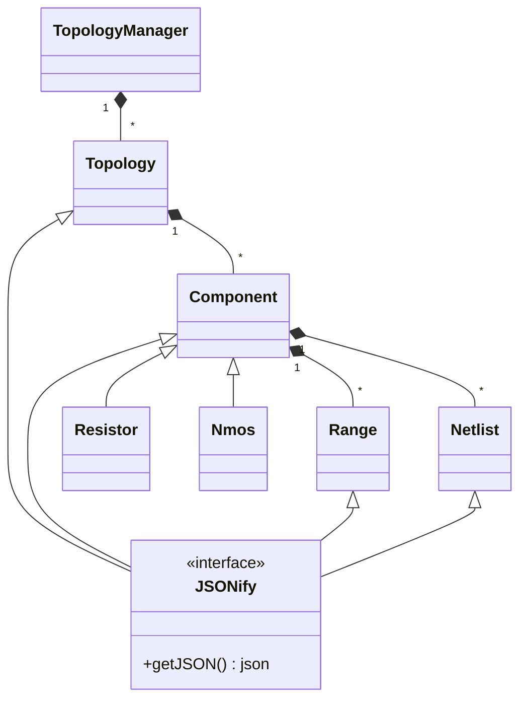

# topology_api
Provide the functionality to access, manage and store device topologies.

## Design hierarchy



## TopologyManager
  It manages topologies stored in memory 
  - It can read from and write to JSON.
  - query about stored topologies, components in topology and connected components in topology.
  - Delete a stored topology.
```cpp
    TopologyManager manager;
    // To read JSON from file and store it 
    manager.readJSON(fileName);

    // Write stored a given topology to a JSON file
    manager.writeJSON(fileName, topologyId);

    // Returns true if topolgy exists in memory, otherwise false
    if(manager.isTopologyExist(topologyId)) 
        cout <<topologyId + " exists in memory" << endl;
    
    // Return stored topology as 'Topology' object
    manager.getTopology(topologyId);

    // Deletes topology from memory
    manager.deleteTopology(topologyId);

    // Return list of stored topologies stored in memory
    auto topologies = manager.queryTopologies();
    for(const auto &topology: topologies)
        cout << topology.getId() << endl;
        
    // Return component list of a give topology
    auto components = manager.queryComponents(topologyId);
    for(const auto &component: components)
        cout << component -> getId() << endl;

    //Return component list of components connected to 'nodeId' in a give topology
    manager.queryComponentsWithNetListNode(topologyId, nodeId);

```

## Execute unit tests
```bash
  cmake -S. -Bbuild
  cmake --build build
  ./build/bin/unit_tests
```
## ToDo list:
  - Make alternative ways to construct 'Component' class without the need of JSON
  
